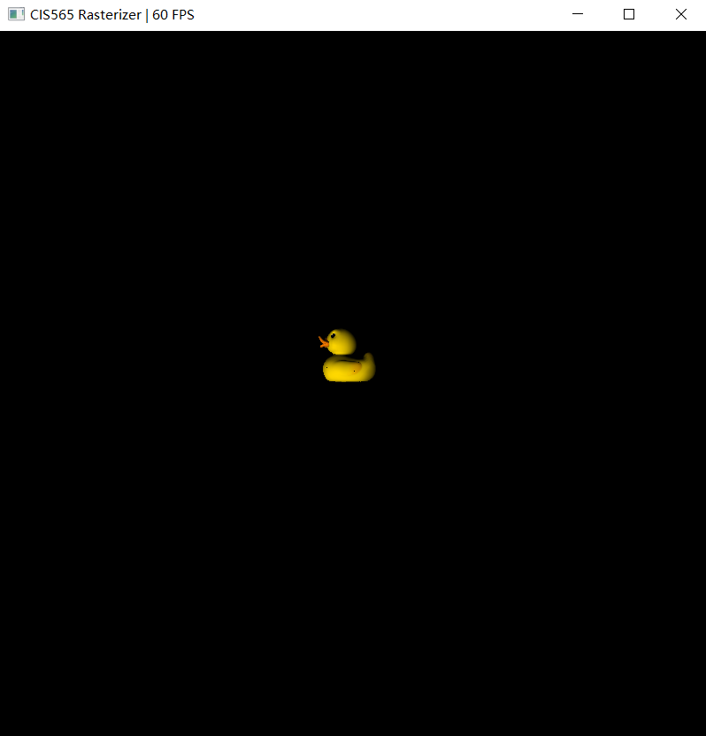
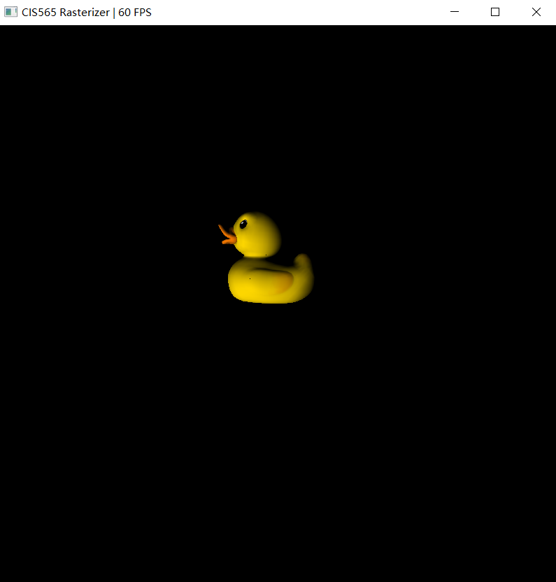

CUDA Rasterizer
===============

[CLICK ME FOR INSTRUCTION OF THIS PROJECT](./INSTRUCTION.md)

**University of Pennsylvania, CIS 565: GPU Programming and Architecture, Project 4**

* Xinyu Lin
[Linkedin](https://www.linkedin.com/in/xinyu-lin-138352125/)
* Tested on: Windows 10, Intel(R) Core(TM) i7-6700HQ CPU@2.60GHz, 16GB, GTX960M(Private Computer)

# Features:
- **Basic features**
  - Basic Lambert shading:
  - Line rasterization mode
  - Point rasterization mode
  - UV texture mapping with perspective correct texture coordinatesbilinear texture
  
Far | Mid | Near
------|------|------
 |  | 
 60Fps | 60Fps | 60Fps
# DOF
  
  - 5000 iterations
  
# OBJ
  
  - 3000 iterations

# Multiply lights
  
  - 10000 iterations

time cost to 5000 iterations

time(secs)	|sort by material id	|store first intersections |  stream compaction | Time
--------------|---------|-------|---------|-------
Diffuse|	0|	0 | 1| 6m54s
Diffuse|	1|	0| 1|12m11s
Diffuse|0 | 1| 1|5m33s

# References
- [ConcentricSampleDisk function](https://pub.dartlang.org/documentation/dartray/0.0.1/core/ConcentricSampleDisk.html)
- [GPU gem3](https://developer.nvidia.com/gpugems/GPUGems3/gpugems3_pref01.html)
- [Schlick's approximation wiki](https://en.wikipedia.org/wiki/Schlick's_approximation)
- some iterative solutions for binary search tree 

### Credits

* [tinygltfloader](https://github.com/syoyo/tinygltfloader) by [@soyoyo](https://github.com/syoyo)
* [glTF Sample Models](https://github.com/KhronosGroup/glTF/blob/master/sampleModels/README.md)
CUDA Path Tracer
================
